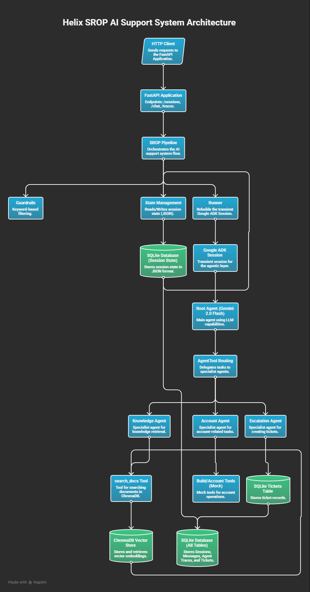

# Helix SROP Assignment Implementation

This repository contains the completed technical assignment for the ServiceHive GenAI Engineer role. It implements a fully functional AI-powered support agent backend using FastAPI, google-adk, SQLAlchemy, and ChromaDB.

## Architecture



### Data Flow Summary

| Step | Component | What Happens |
|------|-----------|--------------|
| 1 | FastAPI route | Validates request body via Pydantic v2 |
| 2 | pipeline.run\_turn() | Loads session.state JSON from SQLite |
| 3 | check\_guardrails() | Refuses out-of-scope messages before any LLM call |
| 4 | InMemoryRunner | Injects DB state into ephemeral ADK session |
| 5 | srop\_root (LlmAgent) | Routes to sub-agent via AgentTool function calling |
| 6 | knowledge\_agent | Calls search\_docs(), cites chunk IDs in answer |
| 7 | account\_agent | Calls mock build/status tools |
| 8 | escalation\_agent | Calls create\_ticket(), stores ticket\_id in state |
| 9 | pipeline.run\_turn() | Parses events, redacts PII, writes trace + messages |
| 10 | pipeline.run\_turn() | Increments turn\_count, saves last\_agent to DB |

## Setup & Running

1. Clone the repository and enter the directory:
   ```bash
   git clone https://github.com/vaibhav3000/helix-srop-assignment.git
   cd helix-srop-assignment
   ```
2. Install `uv` if not already installed:
   ```bash
   pip install uv
   ```
3. Install all dependencies:
   ```bash
   uv sync
   ```
4. Copy the environment variables template and set your `GOOGLE_API_KEY`:
   ```bash
   cp .env.example .env
   # Edit .env and set GOOGLE_API_KEY=<your-key>
   ```
5. Populate the vector store (run once before starting the server):
   ```bash
   uv run python -m app.rag.ingest --path docs/
   ```
6. Start the API server:
   ```bash
   uv run uvicorn app.main:app --reload
   ```
7. Run tests:
   ```bash
   uv run pytest -q
   ```

Or using Docker (Extension E6):
```bash
docker-compose up --build
```

## API Endpoints

| Method | Path | Description |
|--------|------|-------------|
| `POST` | `/v1/sessions` | Creates a new session. Body: `{user_id, plan_tier}`. Returns `{session_id}`. |
| `POST` | `/v1/chat/{session_id}` | Sends a message. Body: `{content}`. Returns `{reply, routed_to, trace_id}`. |
| `GET`  | `/v1/traces/{trace_id}` | Returns the full trace row as JSON for debugging. |
| `GET`  | `/healthz` | Returns `{"status": "ok"}`. Used by Docker health checks. |

## Design Decisions

### State Persistence (Pattern 3 - JSON Column)
Instead of serializing full ADK session objects or implementing a custom `BaseSessionService`, only the fields that need to survive restarts (`turn_count`, `last_agent`, `last_ticket_id`) are stored in a JSON column on the `sessions` table. The ADK session is a short-lived, per-turn object rebuilt from DB state on every request. This requires no external service and is horizontally scalable.

### Document Chunking
Heading-aware chunking (`re.split(r'\n(?=#{1,2} )', body)`) because the Helix docs are structured Markdown — splitting at heading boundaries preserves complete logical sections. Chunks exceeding ~400 tokens are sub-split at sentence boundaries. Chunk IDs are stable SHA-256 hashes of `filepath::chunk_index`, enabling safe re-ingestion via ChromaDB upsert.

### AgentTool Routing
The root agent uses `AgentTool` (not text parsing) to route to sub-agents. Routing is performed by the model's native function-calling mechanism — structured and unambiguous, as required by the assignment spec.

### Transient InMemorySessionService
The ADK `InMemorySessionService` is created per-turn and discarded, not shared globally. This makes the system restart-safe and horizontally scalable since all state lives in SQLite, not in-process memory.

## Extensions Completed

- **E2: Escalation Agent** — A third sub-agent (`escalation_agent`) handles complaints and creates support tickets via DB insertion. The `ticket_id` is stored in `session.state` for follow-up.
- **E5: Guardrails** — Out-of-scope keyword detection (poem, joke, story, etc.) short-circuits before any LLM call. PII (email/phone) is redacted from all tool call arguments before DB write.
- **E6: Docker** — `Dockerfile` + `docker-compose.yml` with persistent volume mounts for `helix.db` and `.chroma`.

## Known Limitations
- Chroma runs in-process (not production-grade for concurrent writes — replace with a Chroma server or Pinecone for multi-worker deployments).
- Mock account data is used for `account_agent` tools.
- No user authentication system (trusts `user_id` from request body).
- Embedding ingestion is synchronous per-chunk (no batching).

## Time Breakdown

| Phase | Time Spent |
|-------|------------|
| Phase 0–2: Boilerplate & DB | 40 min |
| Phase 3–4: RAG Ingest & Retrieval | 50 min |
| Phase 5: ADK Agents Setup | 40 min |
| Phase 6–7: Core Pipeline & API | 60 min |
| Phase 8–9: Tests & Extensions | 50 min |
| **Total** | **~4 hours** |
